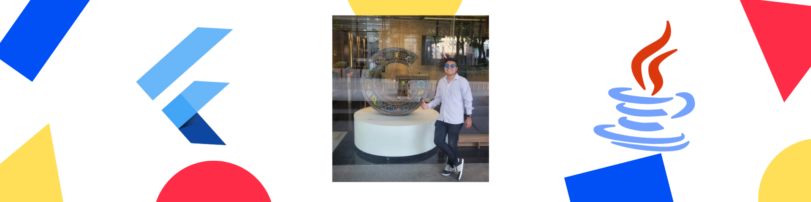

<h1 align="center">Hello World!, I'm Emmanuel Ruiz</h1>
<h3 align="center">A younger guy that like programming and make many projects :) </h3>

- 👨🏻‍💻 I'm software engineering.  
- 🔭 I’m currently working on many projects and in my business. 
- 🌱 I’m currently learning Flutter, Web , Desing Patterns , SOAP Web Service with Java Eclipse 🌘 
- 🧠 I'm constantly learning various technologies..  
- 📱👨🏻‍💻 FrontEnd and Mobile Backend Developer at Flutter/Dart.  
- ☕ Java BackEnd Developer.  
- 🧑🏻‍🏫 Experience teaching programming to different students. 
- 🎨 Designer UX/UI.
- 🗣️ English and Spanish. 
- 🕵️‍♂️ Investigator.  
- 👥 There's no "I" in "Team". 
- 📷 Love photography and video. 

<!--Skill And More Information--> 

  
   
  

 

<!--Social Media-->  

 
  

 <a href="https://www.instagram.com/emmaprofemx/" target="_blank"> 
 <a href="https://www.linkedin.com/in/emmaprofemx/" target="_blank"> 

   
 

<h1 align="left">Technologies</h1>
<h2 align="left">Tools</h2>

  
  
  
  
  
  
  
  
  
  
  
  
  
  
  
  
  
 
  
  
  
  
  
  
  

<h2 align="left">Languages</h2>

 

  
  
  
  
  
  
  
  
  
  
  
  
  
  
  

<i><b>Note:</b> Top languages is only a metric of the languages my public code consists of and doesn't reflect experience or skill level.</i>

